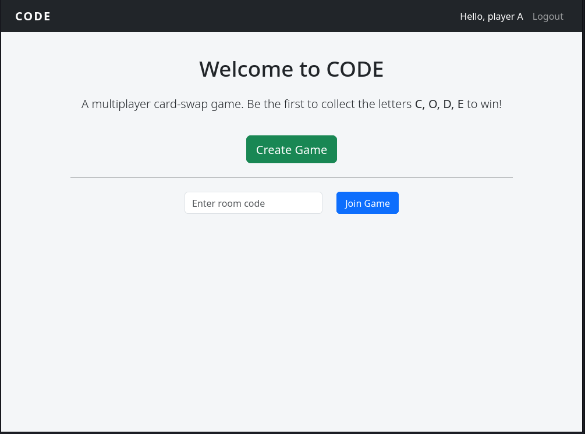
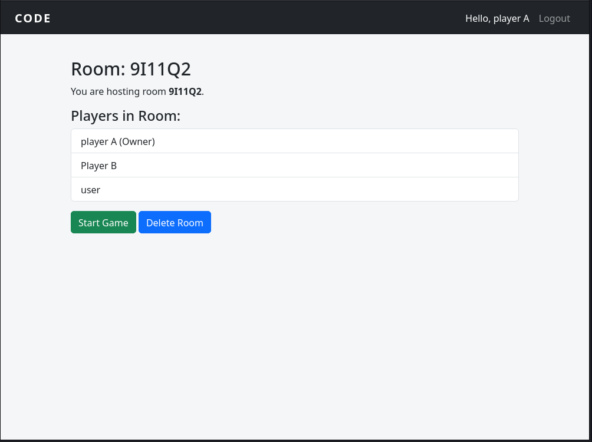
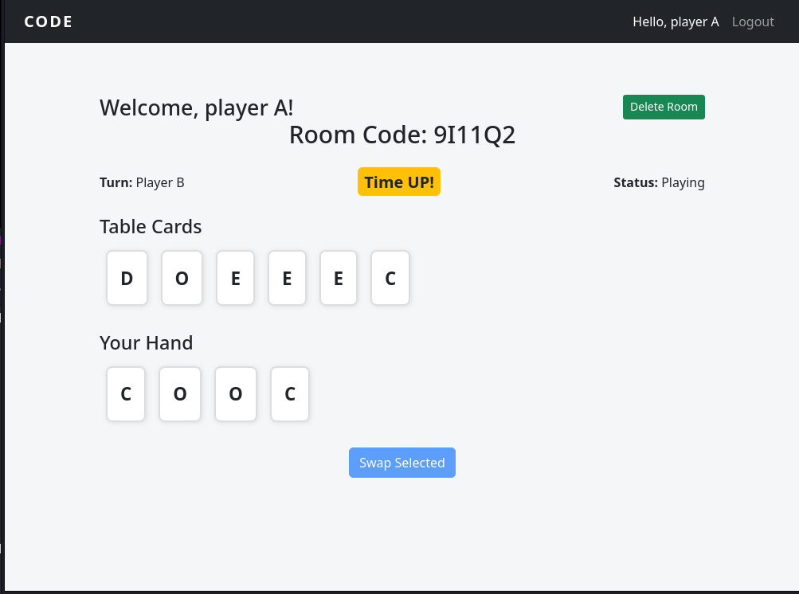

# CODE: A Real-Time Multiplayer Web Game

[](https://youtu.be/lF_DLCy6PEA)

[](https://code-game-h4f3.onrender.com/)

---

# Table of Contents

1. [Introduction](#introduction)
2. [Snapshots](#snapshots)
3. [Distinctiveness and Complexity](#distinctiveness-and-complexity)
   - [Distinctiveness](#distinctiveness)
   - [Complexity](#complexity)
5. [How the Game Works](#how-the-game-works)
6. [Code and Organization](#code-and-organization)
   - [The Project Folder: codegame](#the-project-folder-codegame)
   - [Core Django Files](#core-django-files)
   - [Templates](#templates)
   - [Static Folder](#static-folder)
   - [gitignore, requirements](#gitignore-requirements)
   - [Tests](#tests)
8. [How to Run the Application](#how-to-run-the-application)
9. [Additional Notes](#additional-notes)

---

# Introduction

**CODE** is a real-time multiplayer card game designed entirely for the web. Players join a virtual room and race to collect cards spelling out **C-O-D-E** through turn-based card swapping. It is built using Django, JavaScript, and responsive design techniques, the game supports real-time play with room-based coordination, turn handling, and game state persistence.

The inspiration for this project came from a traditional game called **Kozhithala**, which is popular in my hometown. Players write Malayalam letters on paper chits and compete to collect a specific word. I reimagined that analog game for a digital, globally accessible experience using English letters and a theme relevant to computer science students. The result is a modern, lightweight game that honors its roots while embracing new tech.

This project was not only about building a game, it was about solving a real-world social barrier I faced. During my college years, gaming with friends required downloading various apps, connecting to shared hotspots, and figuring out which game group to join. This hassle often prevented me from joining in. **CODE** is my answer: a shared digital space, instantly accessible, where everyone can play together anytime, anywhere.

---

# Snapshots





# Distinctiveness and Complexity
## Distinctiveness:

What makes this project stand out is its combination of real-time multiplayer game logic, custom turn-based mechanics, and a fully web-native architecture without using WebSockets or game engines. 

Rather than building a static CRUD app or a messaging clone, as many projects in the course tend to be, this project required designing and implementing a full game engine from scratch. It involved real-time coordination and polling logic between players, dynamic win detection, and UI updates per player.

Additional features included host-controlled game start logic and smooth handling of turn order and card exchange in a multiplayer environment. This is a self-designed game with completely original ideas and rules.

## Complexity:

This project is a full multiplayer game system using only Django and JavaScript, managing a surprising amount of complexity behind the scenes. It features multiple interacting models such as Room and Player, and handles dynamic game state including players’ hands, turns, deck, and table cards.

Real-time player synchronization is achieved through repeated polling and custom JSON views, eliminating the need for WebSockets. A REST-style API supports actions like polling and card swapping. The dynamic frontend enables real-time interactions such as card swapping, timed turns, and instant win detection, all without page reloads.

The system also enforces host-based authority, preventing double starts, ensuring a single host, validating card swaps, and checking victory conditions in real time. Impressively, all of this is accomplished without Django Channels, WebSockets, or third-party game frameworks just pure Django, JavaScript, and thoughtfully structured logic.

---

# How the Game Works

Players enter the game by joining or creating a room using a unique code. Once the required number of players have joined, the host can start the game. Each player is then dealt a set of cards and takes turns swapping with the center deck in an effort to collect the four unique letters: C, O, D, E. 

Gameplay is turn-based with enforced time limits, and table cards are visible to all players. The first player to collect all four distinct letters wins the game. Notably, all real-time coordination and state updates are managed through polling-based APIs rather than WebSockets.

---

# Code and Organization

The CODE application is a real-time multiplayer web game built with Django. It has the following structure:

* All backend logic is in a single Django app named game.
* Views are organized in `views.py`, with supporting functions in `game_logic.py` and `utils.py`.
* The project includes modular HTML templates for different screens of the game.
* JavaScript and CSS files are organized under a standalone `static` folder.
* All components work together to enable seamless real-time gameplay.

Let’s break down each part of the codebase.

## The Project Folder: codegame

This contains the standard Django configuration including `settings.py`, `urls.py`, and WSGI/ASGI entry points. It maps routes to the game app and includes all necessary configurations for local development and deployment.

## Core Django Files

The application's backend is structured across several key Python files, each serving a distinct purpose to ensure clarity and maintainability. 

The `views.py` file manages user interactions, handling actions such as creating or joining rooms, starting the game, swapping cards, polling for updates, and checking win conditions. Core data structures are defined in `models.py`, which includes the `Room` model representing a game room with its host and status and the `Player` model, which tracks individual player details such as their cards, turn status, and room association. 

Routing is handled by `urls.py`, which maps both the page views and API endpoints required by the application. The `game_logic.py` file encapsulates core game mechanics through reusable functions like `start_game`, `deal_cards`, `swap_card`, and `check_win`, effectively separating logic from view handling. Finally, `utils.py` provides helpful utility functions such as `generate_room_code()` and `shuffle_deck()`, supporting room creation and gameplay dynamics.

## Templates

Each game screen is implemented as a separate HTML file within the `templates` directory to maintain a modular and organized structure. 

At the core is `layout.html`, the base layout shared across all pages to ensure visual and functional consistency. Serving as the landing page, `home.html` presents login and registration options along with an introduction to the game. Users can host or create a new room through `create.html`, while `join.html` acts as the lobby where players wait for the game to begin. Once the game starts, `game.html` delivers the main interface, complete with cards, a timer, and interactive elements essential to gameplay.

## Static Folder

The application’s static assets, including all CSS and JavaScript files, are organized by functionality to support a clean and maintainable front-end structure. 

The `styles.css` file defines the visual design, including a responsive grid layout for cards, hover animations, and mobile-friendly adjustments. On the JavaScript side, `lobby.js` is responsible for polling the server to determine if the game has started and redirects players to the game interface when ready. Meanwhile, `game.js` handles the core client-side gameplay logic, such as managing card swaps, controlling turn timers, and detecting win conditions in real time.

## gitignore, requirements

A .gitignore so that the genv is not pushed to git and requirements.txtLists Python dependencies required for the project to run.

## Tests

A `tests.py` file can be added to the Django app to define unit tests for models, views, and game logic. To run tests:

```bash
python manage.py test
```

---

# How to Run the Application

1. **Clone the repository**:

   ```bash
   git clone https://github.com/yourusername/code-game.git
   cd code-game
   ```

2. **Create virtual environment and install dependencies**:

   ```bash
   python3 -m venv genv
   source genv/bin/activate
   pip install -r requirements.txt
   ```

3. **Apply migrations and start the server**:

   ```bash
   python manage.py migrate
   python manage.py runserver
   ```

4. **Access in your browser**:
   Open `http://127.0.0.1:8000/` in your browser and follow these steps:

   log in or register an account, then create a new room or join an existing one. Once in the lobby, wait for other players to join. When everyone is ready, start the game. From there, swap cards strategically and race to be the first to spell **C-O-D-E**!


---

# Additional Notes

The app is currently built without WebSockets, relying instead on polling for real-time updates. For improved performance and responsiveness, integrating **Django Channels** would be a strong enhancement. The victory condition in the game is clearly defined: a player wins when their hand contains exactly one of each letter **'C', 'O', 'D', and 'E'**.

